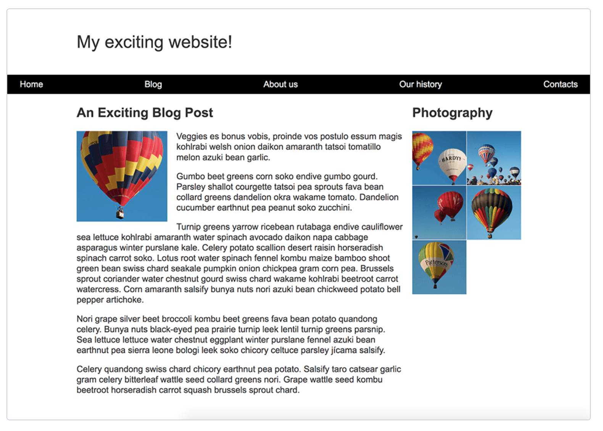

# Layout Challenge

You have been provided with some raw HTML, basic CSS, and images and need to create a layout for the design, which should look just like the image below.

You need to implement the webpage layout and accomplish these tasks:

- Display the navigation items in a row, with an equal amount of space between the items.
- The navigation bar should scroll with the content and then become stuck at the top of the viewport when it reaches it.
- The image that is inside the article should have text wrapped around it.
- The `article` and `aside` elements should display as a two column layout. 
  - The columns should be a flexible size so that if the browser window shrinks smaller the columns become narrower.
- The photographs should display as a two column grid with a 1 pixel gap between the images.

There are a few ways in which you could achieve some of these tasks, and **there often isn't a single right or wrong way to do things.**

# What's expected

You will not need to edit the HTML in order to achieve this layout. 

The techniques you should use are:

- Positioning
- Float
- Flexbox
- CSS Grid Layout

# Objective

The purpose of this challenge is to get you working with different layout techniques, and test that you understand how each of them behaves.
